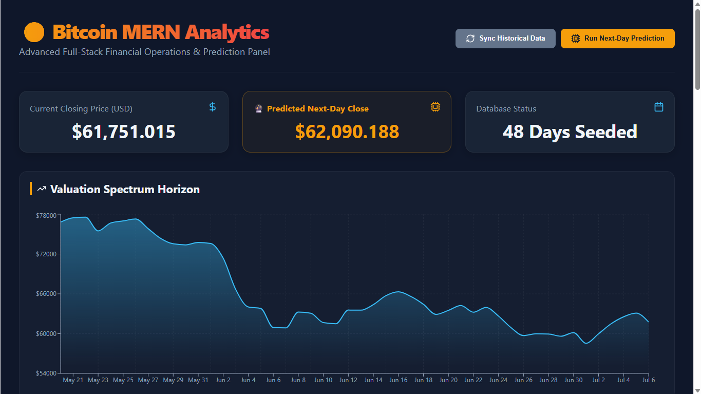

# 🪙 Bitcoin MERN Analytics

A full-stack MERN app that pulls live Bitcoin market data from the CoinGecko API, stores it in MongoDB, visualizes price history on an interactive chart, and generates a simple next-day price estimate based on recent momentum.

Built as a semester project to practice REST API design, third-party API integration, MongoDB upsert patterns, and building a data dashboard with React + Recharts.

> **Note on scope:** This is intentionally a simple, focused project — not a production trading system. See [Limitations](#-known-limitations--honest-notes) below for what it does and doesn't do.

---

## ✨ Features

- **Live data sync** — fetches the last 30 days of Bitcoin price/volume data from CoinGecko and upserts it into MongoDB (re-running sync updates existing days instead of duplicating them)
- **Price history dashboard** — area chart (Recharts) visualizing closing price over time
- **Next-day price estimate** — computes a simple 7-day moving-average momentum score and projects a next-day close
- **Metrics cards** — current closing price, latest prediction, and number of days stored
- **CRUD table** — view all stored records with the ability to delete individual entries
- **Clean REST API** — separate routes for sync, history, prediction, and deletion

---

## 🛠 Tech Stack

| Layer        | Technology                                              |
|--------------|----------------------------------------------------------|
| **Frontend** | React 19, Vite, Recharts (charts), Axios, lucide-react (icons) |
| **Backend**  | Node.js, Express 5                                        |
| **Database** | MongoDB (Mongoose)                                        |
| **External API** | [CoinGecko API](https://www.coingecko.com/en/api) (free tier) |

---

## 🔌 API Endpoints

| Method | Endpoint                     | Description                                          |
|--------|-------------------------------|-------------------------------------------------------|
| GET    | `/api/bitcoin/fetch-live`    | Fetches last 30 days from CoinGecko and upserts to DB |
| GET    | `/api/bitcoin/history`       | Returns all stored records, sorted by date            |
| POST   | `/api/bitcoin/predict`       | Computes and saves a next-day price estimate          |
| DELETE | `/api/bitcoin/delete/:id`    | Deletes a single record by ID                          |

---

## ⚙️ Setup Instructions

### 1. Clone the repository
```bash
git clone https://github.com/alisheikh2/bitcoin-mern-app.git
cd bitcoin-mern-app
```

### 2. Backend setup
```bash
cd backend
npm install
```

Create a `.env` file in `backend/`:
```
PORT=5000
MONGO_URI=your_mongodb_connection_string
```

Run the backend:
```bash
npm start
```

### 3. Frontend setup
```bash
cd ../frontend
npm install
npm run dev
```

The app will be available at `http://localhost:5173`, connecting to the backend at `http://localhost:5000`.

> Currently the frontend calls `http://localhost:5000` directly rather than through an environment variable — see [Future Improvements](#-future-improvements) if you plan to deploy this.

---

## 📸 Screenshots

*(Add screenshots here — see suggestions below)*

```markdown


```

---

## ⚠️ Known Limitations & Honest Notes

- **OHLC values are approximated.** CoinGecko's free-tier `market_chart` endpoint only returns closing price and volume — it does not provide real open/high/low data. This app approximates open/high/low as ±1–2% of the closing price. This is a simplification, not real historical OHLC data.
- **The "prediction" is a moving-average momentum formula, not a trained model.** It looks at the last 7 days of closing prices, computes a momentum ratio against the average, and projects it forward. It's deterministic and repeatable — not machine learning.
- **No authentication.** All endpoints are open; anyone with the API URL can sync, predict, or delete records. Fine for a personal/demo project, not suitable as-is for a multi-user production app.

---

## 🚀 Future Improvements

- Add authentication so records are scoped per user
- Move the frontend API base URL into an environment variable for easy deployment
- Add pagination/date-range filtering for the history table as data grows
- Replace the momentum formula with a real trained model (e.g. the LSTM-based approach used in [my other Bitcoin prediction project](#)) for a genuine ML comparison

---

## 👨‍💻 Developer

**Ali** — [GitHub](https://github.com/alisheikh2)
